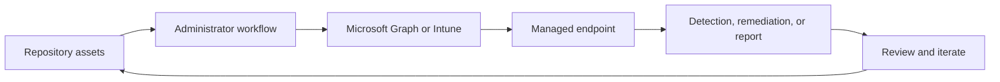

<!-- unified-readme:start -->
<div align="center">

# Smartphone Replacement Tool

**Archived tooling for mobile device replacement and endpoint management workflows.**

Build. Automate. Share.

[](https://github.com/JayRHa/SmartphoneReplacementTool/stargazers)
[](https://github.com/JayRHa/SmartphoneReplacementTool/network/members)
[](https://github.com/JayRHa/SmartphoneReplacementTool/issues)
[](https://github.com/JayRHa/SmartphoneReplacementTool/graphs/contributors)

---

`Endpoint Management` | `PowerShell` | `Public` | `Archived`

</div>

## What is this?

Smartphone Replacement Tool supports Microsoft Intune and endpoint management workflows such as automation, troubleshooting, remediation, deployment, or reporting.

## Project Context

- Use it when Intune work should be scripted, packaged, synchronized, or made easier to repeat.
- Most workflows start from repository assets, then move through Microsoft Graph, Intune, or device-side execution.
- This repository is archived and kept as a reference implementation.

## How It Works

The repository stores scripts or tooling, administrators configure or run them, Intune and Microsoft Graph apply the work, and endpoint results feed back into reports or follow-up actions.



## Quick Start

1. Review the project context and workflow below.
2. Clone the repository:

   ```bash
   git clone https://github.com/JayRHa/SmartphoneReplacementTool.git
   ```

3. Continue with the setup, usage, or workflow sections below.

---
<!-- unified-readme:end -->

# Smartphone Replacement Tool
[Blog Post](https://jannikreinhard.com/)
<p align="left">
  <a href="https://twitter.com/jannik_reinhard">
    
  </a>
    <a href="https://github.com/JayRHa">
    
  </a>
</p>


